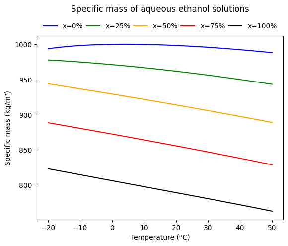
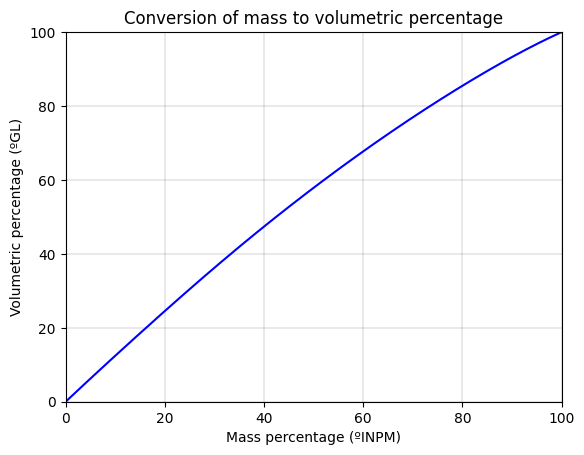
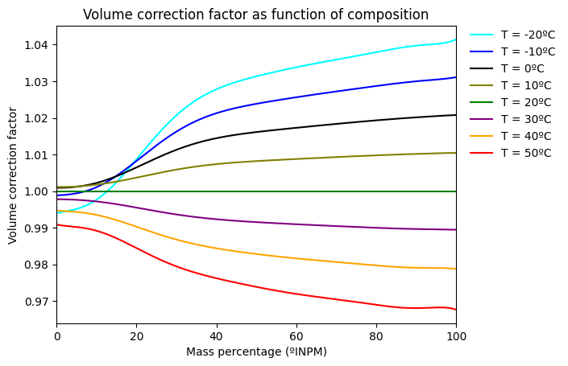

# Ethanol and its mixtures with water - Determination of the density and alcoholic strength - Glass densimeter method

This Python notebook script calculates the density of an ethanol-water mixture based on the mass percentage of ethanol and temperature, using the glass densimeter method as specified in the ABNT NBR 5992 - 17.12.2008 standard. The coefficients of Bettin and Spieweck (1990) are employed for the calculations.

## Functions
1. EtOH_Dens(xm, T):
This function calculates the specific mass (density) of an ethanol mixture given the mass percentage of ethanol (xm) and temperature (T). It utilizes a series of coefficients and mathematical equations to determine the specific mass of the mixture.

2. EtOH_GL(xm, D):
This function calculates the volumetric composition of an ethanol mixture based on the mass percentage of ethanol (xm) and the density of the mixture (D). The calculation assumes a reference temperature of 20°C.

3. EtOH_VCF(D, D20, T):
This function calculates the volume correction factor (VCF) for an ethanol mixture based on its density (D), density at 20°C (D20), and temperature (T). The VCF is used to correct the volume of a liquid for temperature variation.

## Graphs
### Specific Mass vs Temperature
The script generates a graph illustrating the specific mass of ethanol mixtures at different mass percentages as a function of temperature.

### Mass Percentage vs Volumetric Percentage
Another graph shows the relationship between the mass percentage of ethanol and its volumetric percentage in the mixture.

### Volume Correction Factor vs Mass Percentage
The script generates a graph displaying the volume correction factor (VCF) as a function of the mass percentage of ethanol for various temperatures.

### Usage Notes
- Ensure that the required libraries are installed before running the script.
- The input values for mass percentage (xm) should be between 0 and 100%, and the temperature (T) should be between -20 and 50°C.

Feel free to use, modify, and extend this script as needed for your specific application.